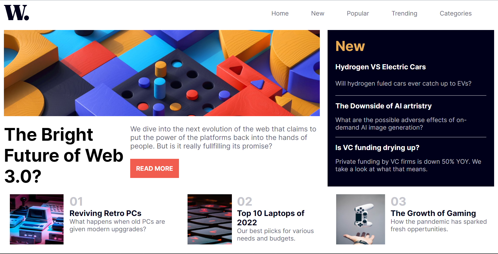
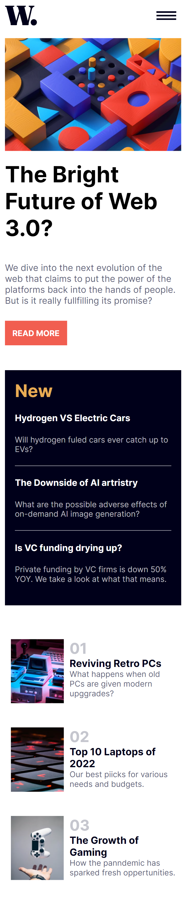

# News Homepage

## Table of contents

- [Overview](#overview)
  - [The challenge](#the-challenge)
  - [Screenshot](#screenshot)
  - [Links](#links)
- [My process](#my-process)
  - [Built with](#built-with)
  - [What I learned](#what-i-learned)
  - [Continued development](#continued-development)
- [Author](#author)

**Note: Delete this note and update the table of contents based on what sections you keep.**

## Overview

### The challenge

Users should be able to:

- View the optimal layout for the interface depending on their device's screen size
- See hover and focus states for all interactive elements on the page
- Toggle the mobile menu (requires some JavaScript)

### Screenshot

### Links

- Solution URL: [Frontend Mentor](https://www.frontendmentor.io/solutions/news-homepage-U2kBg2zxb7)
- Live Site URL: [Netlify](https://news-homepage-by-gaurav.netlify.app/)

## My process

### Built with

- [React](https://reactjs.org/) - JS library
- CSS custom properties
- Flexbox

### What I learned

I learned how important it is to plan everything before you start. For e.g. I did not plannned how the "New" and "Home" components will be at the same level in desktop view and created its structure without keeping the above in mind.

### Continued development

This project and other 2-3 before this were made to kind of brush up frontend (specifically React and CSS) before I go one to start making fullstack projects.

## Author

- GitHub - [@Gauravtripathii](https://github.com/Gauravtripathii/)
- Frontend Mentor - [@Gauravtripathii](https://www.frontendmentor.io/profile/Gauravtripathii)
- LinkedIn - [@Gaurav Kumar Tripathi](https://www.linkedin.com/in/gaurav-kumar-tripathii/)
- Twitter - [@gaurav0tripathi](https://twitter.com/gaurav0tripathi)
